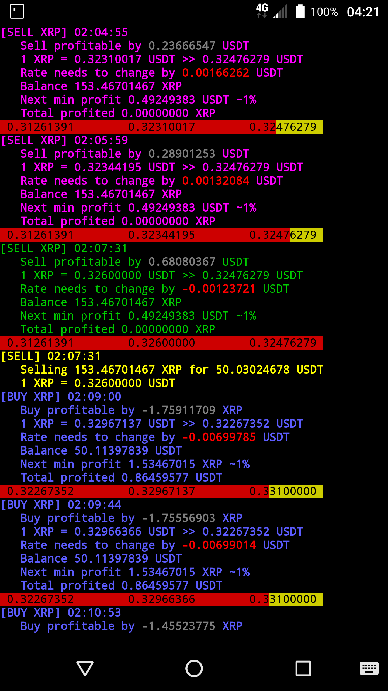
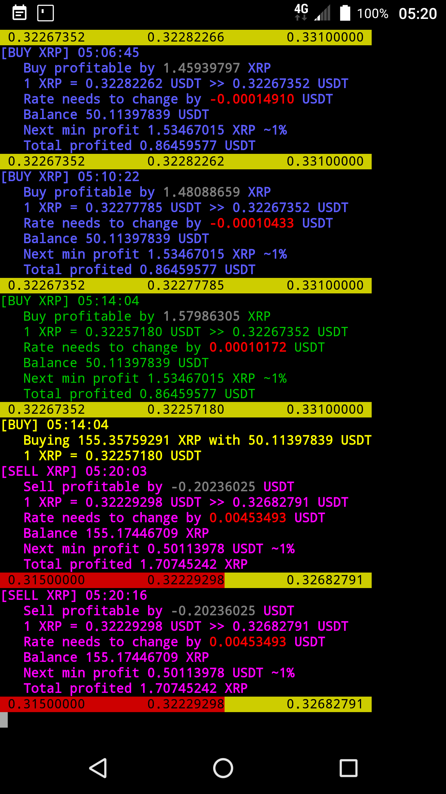

Clone with command
```
git clone --recursive https://github.com/hazardland/trader.php.git ./trader
```
Checkout all submodules to master branch with command inside ./trader dir
```
git submodule foreach --recursive git checkout master
```
Runing on Android with Termux

<div>


</div>

# Usage

1. Edit *./config.php* file
3. Run ```php ./bot.php```

# Config directives

**pair** - Your poloniex trading pair like *USTD_XRP* or *BTC_ETC*

*win-percent* - Minumum much percent you want to win on your next trade. For example if you bought *10 USDT* with *100 XRP* if you set win-percent to *1%*, trader will wait until it can afford *101 XRP* + trading fees on next trade.

**first-trade-currency**, **first-trade-amount** - This values indicates minumum how much and what currency trader must trade for on the first trader. For example you bought *100 XRP* with *50 USD*, then you might want to get minimum *50 USD* + win percent of *50 USD* on your first trade so you set *first-trader-currency=USDT* and *first-trade-amount=50*

And also you will have to set **poloniex-key**, **poloniex-secret**.

# Warrning

Be aware that bot currently trades with all amout you have on pair currency balances.

# Strategy

There is not almost any strategy involved except that bot sells and waits until it can buy more than it sold. In order to have some profit your target currency must be returning at same rate between time intervals.

# Risks

Your bot might sell and never buy because currency rate is never going down from sell point or it might buy and never sell because your currency price is never going up.
